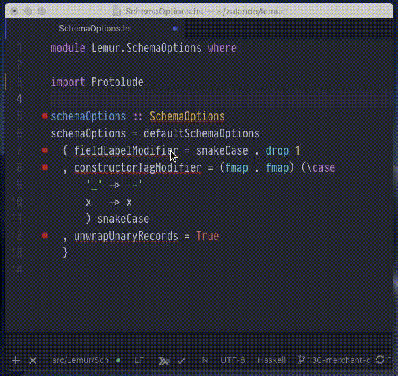

# Atom Haskell Import



Currently the relative path to your hoogle DB is globally hardcoded in the config.

## Requirements
I only tested this with a stack project

You need to install the command line tools:
- `hoogle`
- `hsimport`

I managed to do this by running the following
```
cd ~
stack install hoogle
stack install hsimport
```

In order to create a workable local hoogle database for your stack project please run:
```
stack hoogle generate -- --local
```
This is disgustingly slow the first time around but should be quicker with time.
If you find yourself unable to find some local imports you might want to run this command again after a successfull compilation run.

Now, hitting `ctrl+i` when the cursor is on a symbol should trigger the import view.
